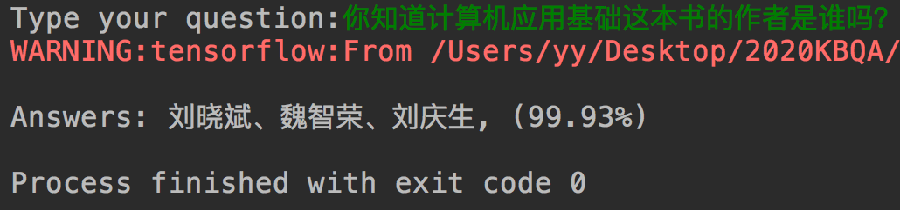

# 基于BERT的KBQA系统

## 项目架构

基于NIPCC知识库问答数据集，利用BERT+BiLSTM+CRF进行命名实体识别，抽取问题中的实体。从知识库中提取实体相关的所有属性，利用BERT训练句子相似度计模型，计算问题与各属性之间的文本相似度，基于相似度对属性排序，最终得到问题答案。

目前只用了知识库实现（MySQL），后续会钻研一下知识图谱。

## 运行说明

下载文件：

- Google官方BERT：https://github.com/google-research/bert ，更名为```bert```，放在根目录下
- BERT中文配置文件：[chinese_L-12_H-768_A-12](https://storage.googleapis.com/bert_models/2018_11_03/chinese_L-12_H-768_A-12.zip)，放在```bert```目录下
- NIPCC数据集：[data/NLPCC2016KBQA](data/NLPCC2016KBQA)（可自行官方下载）

数据集构建（请先更改```data_config.py```的MySQL配置）：

```shell
$ mkdir data/NER
$ mkdir data/SIM
$ cd data_helper
$ python ner_data.py
$ python sim_data.py
$ python kb_data.py
$ cd ..
```

训练命名实体识别模型（NER）：

```shell
$ cd ner
$ mkdir output
$ ./run_ner.sh
$ cd ..
```

将```ner/ner_config.py```中的```model_file=model/xxxxxxx```更改为```ner/output/model```下的文件夹名称。

训练文本相似度模型（SIM）：

```shell
$ cd sim
$ mkdir output
$ ./run_sim.sh
$ cd ..
```

将```sim/sim_config.py```中的```model_file=model/xxxxxxx```更改为```sim/output/model```下的文件夹名称。

进行线上的问答测试：

```shell
$ python kbqa.py
```

效果如下：



## 环境

- python 3.6.5
- tensorflow 1.14
- 云端训练：极客云-RTX 2080 Ti 双卡 Ryzen 9 3900X 24核32G 2TB SSD 网速D1000/U50